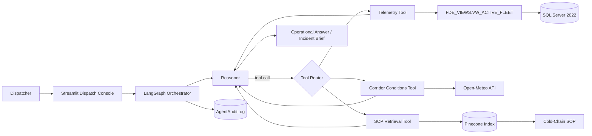

# Cold-Chain Logistics AI Assistant

> A production-shaped Forward-Deployed Engineering project that lets dispatchers investigate fleet anomalies and retrieve compliance guidance through a conversational interface.

## Project links

| Resource | Link | Status |
| --- | --- | --- |
| Primary implementation | [Tirth-1999/Cold-Chain-FDE](https://github.com/Tirth-1999/Cold-Chain-FDE) | Current implementation |
| Original/reference repository | [nimowhyca/cold-chain-logistics-FDE-Project](https://github.com/nimowhyca/cold-chain-logistics-FDE-Project) | Starting point and design materials |
| Deployment workflow | [GitHub Actions workflow](https://github.com/Tirth-1999/Cold-Chain-FDE/actions/workflows/deploy.yml) | Manual EC2 deployment |
| Source dataset | [Logistics and Supply Chain Dataset on Kaggle](https://www.kaggle.com/datasets/datasetengineer/logistics-and-supply-chain-dataset) | Fleet telemetry source |
| Business presentation | [FDE project presentation](https://github.com/nimowhyca/cold-chain-logistics-FDE-Project/blob/main/Misc/Materials/FDE-YT-Project-Business-Presentation.pdf) | Problem, solution, and governance overview |
| Technical design | [Technical Design Document](https://github.com/nimowhyca/cold-chain-logistics-FDE-Project/blob/main/Misc/Materials/Technical%20Design%20Document%20%28TDD%29_%20Cold-Chain%20Logistics%20AI-Assistant.pdf) | Original HLD/LLD and AWS topology |
| Live application | [Open the Cold-Chain Dispatch Console](https://tinyurl.com/2db682kf) | Public short link; check EC2 service health before sharing |
| Direct application URL | [EC2 Streamlit deployment](http://18.215.177.166:8501/) | Direct fallback URL |
| Demo video | **Add YouTube/Loom URL** | Add after recording |
| LinkedIn post | **Add LinkedIn post URL** | Add after publishing |

> During verification, the live application loaded and successfully answered both an SOP question and a fleet-telemetry question. The EC2 endpoint then became unreachable during a later health check, so confirm the instance and `streamlit` systemd service are healthy before publishing the link. The TinyURL itself correctly redirects to the direct EC2 URL.

> **Public-link note:** the TinyURL is convenient for sharing, but it ultimately redirects to the EC2 server over plain HTTP. For a durable portfolio deployment, attach a domain name and terminate HTTPS with a reverse proxy or an AWS load balancer. An EC2 public IP can also change unless it is backed by an Elastic IP.

## The problem

Cold-chain dispatchers often have to jump between telemetry dashboards, weather tools, SQL queries, and long SOP documents while a shipment is already at risk. That manual workflow increases response time and makes it harder to apply the correct escalation policy consistently.

This project turns that fragmented process into one governed conversation. An operator can ask about a temperature excursion, a risky corridor, or an escalation rule; the agent selects the required systems, gathers evidence, and produces an action-oriented response.

## What was implemented

- A LangGraph reasoning loop with `reasoner -> tools -> reasoner` execution and per-session in-memory checkpoints.
- Three purpose-built tools:
  - `query_telemetry_db` for active-fleet telemetry in Microsoft SQL Server.
  - `fetch_corridor_conditions` for current external temperature and wind data from Open-Meteo.
  - `search_compliance_sop` for Pinecone-backed retrieval over cold-chain policy documents.
- A hardened system prompt that routes SOP questions directly to retrieval, routes live investigations through the relevant tools, refuses unrelated requests, and enforces a structured incident brief for anomaly investigations.
- A semantic SQL view, `FDE_VIEWS.VW_ACTIVE_FLEET`, that translates legacy column names into agent-friendly fields.
- A least-privilege SQL identity, `USR_FDE_RO`, with access to the governed view but not the raw legacy table.
- A Streamlit dispatch console with conversation threads, visible tool inputs/outputs, session reset, a guided “Questions to Try” catalog, and an administrator-gated audit viewer.
- An append-only agent audit path that records tool requests, tool results, and final model responses in `FDE_VIEWS.AgentAuditLog`.
- Incremental SOP ingestion with content hashes, changed-file replacement, deleted-file cleanup, batching, and separate Pinecone indexes for OpenAI and local embeddings.
- Configurable model paths: OpenAI, DeepSeek, or local Ollama for reasoning; OpenAI or local Hugging Face `BAAI/bge-m3` for embeddings.
- A manual GitHub Actions deployment that validates secrets, checks SSH reachability, pulls the latest `main`, restarts the Streamlit systemd service, and verifies service health.
- A split-tier AWS deployment design: one EC2 node for the Streamlit/LangGraph app and another EC2 node for SQL Server 2022 in Docker, connected through private VPC networking and restrictive security-group rules.

## Architecture



### Runtime flow

1. The dispatcher submits an operational question in Streamlit.
2. The system prompt and conversation state are passed to the configured reasoning model.
3. The reasoner selects only the tools required for that question.
4. Tool calls execute against governed SQL, the weather API, or the SOP vector index.
5. Tool inputs and outputs are shown in the UI and written to the audit table.
6. The reasoner synthesizes the evidence into either a direct SOP answer or a structured incident report.

## Data and security model

The security boundary is enforced in SQL Server, not only in the prompt.

| Layer | Control |
| --- | --- |
| Raw telemetry | Stored in `dbo.TBL_SC_FLEET_HIST_RAW` and denied to the agent identity |
| Semantic access | Exposed through `FDE_VIEWS.VW_ACTIVE_FLEET` with readable business field names |
| Agent identity | `USR_FDE_RO` receives `SELECT` only on the semantic view |
| Tool-level check | Telemetry tool accepts only queries beginning with `SELECT` and returns at most 10 rows |
| Audit trail | Agent identity receives `INSERT` access to `FDE_VIEWS.AgentAuditLog`; the UI uses admin authentication to read logs |
| Network boundary | SQL port 1433 should accept traffic only from the application EC2 security group/private network |
| Public ingress | Streamlit is served on port 8501; SSH remains limited to the deployment path |

Secrets belong in `.env` locally and in GitHub Environment secrets for deployment. They must not be committed or shown in demo recordings.

## RAG pipeline

The ingestion script scans Markdown, text, PDF, CSV, and Excel policy assets. It performs format-aware parsing, chunks text into approximately 600-character segments with overlap, adds source metadata, and upserts deterministic chunk IDs into Pinecone.

Two isolated index configurations are supported:

| Mode | Embedding model | Pinecone index | Dimensions |
| --- | --- | --- | --- |
| Cloud | OpenAI embeddings | `fde-sop-index-openai` | 1536 |
| Local fallback | `BAAI/bge-m3` | `fde-sop-index-local` | 1024 |

The hash cache skips unchanged files and removes vectors for policy files that have been deleted, preventing stale or duplicate SOP content.

## Demo script

### Questions the agent is designed to answer

The following questions match the current system prompt, available SQL fields, and tool capabilities. They are grouped by the route the agent should take.

#### Fleet telemetry questions

These should primarily call `query_telemetry_db`:

1. **What are the five highest current temperature readings in the active fleet, and where are they located?**
2. **Show the five active fleet records with the highest route-risk index. Include temperature, risk classification, and delay probability.**
3. **How many active records are classified as High Risk and have a delay probability above 0.65?**
4. **Find active fleet records near Los Angeles, around latitude 33.8 and longitude -118.1.**
5. **Which active records currently have a temperature above 4°C?**
6. **What date range is represented by the active fleet telemetry?**
7. **Show records where port congestion is above 7 and sort them by route risk.**

#### SOP and dispatcher-procedure questions

These should primarily call `search_compliance_sop` and cite the retrieved SOP:

1. **What temperature range must fresh perishables maintain?**
2. **What makes a temperature reading a critical cold-chain breach?**
3. **What should a dispatcher do immediately after a critical temperature breach?**
4. **When must a vehicle be diverted to an emergency cold-storage facility?**
5. **What is the difference between a Tier 1 and Tier 2 escalation?**
6. **What combination of risk classification and delay probability triggers Tier 2 escalation?**
7. **What is the required response when the Port of Los Angeles or Long Beach congestion level exceeds 7?**
8. **When should freight be diverted to the Inland Empire Overflow Depot?**

#### Weather and corridor questions

These should primarily call `fetch_corridor_conditions`:

1. **What are the current weather conditions at latitude 33.8 and longitude -118.1?**
2. **Check the external temperature and wind speed near Los Angeles.**
3. **Does the current wind-based corridor-risk heuristic indicate normal conditions or high disruption at 33.77, -118.19?**
4. **Compare current corridor conditions at two GPS locations and tell me which appears riskier.**

> The current corridor tool uses live Open-Meteo temperature and wind readings. Its displayed congestion index is a wind-based heuristic, not a live road-traffic measurement.

#### Full incident-investigation questions

These combine telemetry, external conditions, and SOP retrieval. The system prompt instructs the model to respond with an Executive Summary, a Telemetry & Environment Analysis table, and a Required Action Plan.

1. **Find active shipments near Los Angeles, check the current weather there, and determine whether the temperature violates the fresh-perishables SOP. What should the dispatcher do?**
2. **Find the hottest active fleet record, check conditions at its coordinates, and give me the SOP-compliant response if it is above 4°C.**
3. **Identify any High Risk active records with delay probability above 0.65 and explain the required escalation.**
4. **Find active records with port congestion above 7 and tell me what diversion action the SOP requires.**
5. **Investigate the active record with the highest route-risk index. Include its telemetry, local weather, operational risk, and required SOP actions.**

#### Follow-up questions within the same session

Because the LangGraph checkpointer retains the current Streamlit session in memory, users can ask follow-ups such as:

- **Which of those records should I prioritize first, and why?**
- **Now show only the High Risk results.**
- **What exact SOP rule supports that action?**
- **Summarize that incident for the night-shift manager.**
- **What information is still missing before the dispatcher acts?**

#### Questions the agent should refuse

The system prompt explicitly refuses unrelated requests without calling tools. Examples include:

- **Write Python code for a website.**
- **Tell me a joke.**
- **Give me personal advice.**
- **Who won yesterday's game?**

The refusal should be brief and invite the user to ask about cold-chain operations, fleet telemetry, corridor conditions, or SOP guidance instead.

### Demo 1: End-to-end incident investigation

Paste this into the Dispatch Console:

> Find any active shipments near Los Angeles (latitude about 33.8, longitude about -118.1). Check the local weather there and tell me whether the current cargo temperature violates the SOP for fresh perishables.

Expected behavior:

1. The agent queries the governed telemetry view.
2. It calls Open-Meteo for current conditions at the selected coordinates.
3. It retrieves the applicable temperature and mitigation rules from Pinecone.
4. It returns an executive summary, telemetry/environment table, and SOP-grounded action plan.

### Demo 2: SOP-only routing

> I am a new dispatcher on the night shift. Explain the difference between a Tier 1 and Tier 2 escalation.

Expected behavior: the agent uses the SOP retrieval tool without running an unnecessary fleet query or corridor check.

### Demo 3: Governed data access

Show these two SQL checks while connected as the agent identity:

```sql
-- Expected to succeed
SELECT TOP 5 *
FROM FDE_VIEWS.VW_ACTIVE_FLEET;

-- Expected to fail
SELECT TOP 5 *
FROM dbo.TBL_SC_FLEET_HIST_RAW;
```

### Demo 4: Auditability

1. Run either agent scenario.
2. Open **Security & Audit Logs** in the sidebar.
3. Authenticate with the administrator credentials stored in the deployment environment.
4. Show the session token, graph node, tool name, timestamp, and recorded payload for the completed run.

### Demo 5: Deployment workflow

Open the repository's [Actions page](https://github.com/Tirth-1999/Cold-Chain-FDE/actions/workflows/deploy.yml), run **Enterprise Manual Deploy**, and show the following gates:

- GitHub Environment secret validation.
- Port 22 reachability check.
- Fast-forward-only pull of `main`.
- systemd restart.
- post-restart service health verification.

## Local run

### Prerequisites

- Python 3.12+
- Docker or access to the SQL Server EC2 node
- [Microsoft ODBC Driver 18 for SQL Server](https://learn.microsoft.com/en-us/sql/connect/odbc/download-odbc-driver-for-sql-server)
- Pinecone API key
- One configured reasoning-model path

### Environment variable names

```dotenv
SQL_SERVER_HOST_CLOUD=
SQL_SERVER_PORT=1433
SQL_ADMIN_USER=
SQL_ADMIN_PASSWORD=
SQL_VIEW_AI_AGENT_USER=USR_FDE_RO
SQL_VIEW_AI_AGENT_PASSWORD=

PINECONE_API_KEY=
EMBEDDING_MODE=LOCAL
Local_Embedding_Model=BAAI/bge-m3

Agent_llm=OLLAMA
OPENAI_API_KEY=
DEEPSEEK_API_KEY=
```

Only populate keys required by the model and embedding modes you select.

### Start the project

```bash
python3 -m venv .venv
source .venv/bin/activate
pip install -r requirements.txt

python scripts/Ingesting_legacy_data.py
python scripts/ingesting_pinecode_data.py

# Run scripts/Setup_security_and_view.sql in SQL Server before starting the app.
streamlit run src/ui.py
```

The full infrastructure runbook is in [`docs/Instruction.md`](docs/Instruction.md).

## Repository map

```text
.github/workflows/deploy.yml       Manual SSH deployment and health checks
data/policy/                       SOP knowledge source
data/raw/                          Legacy logistics dataset
docs/Instruction.md               Setup and deployment runbook
scripts/Ingesting_legacy_data.py   CSV-to-SQL ingestion
scripts/ingesting_pinecode_data.py Policy parsing and Pinecone synchronization
scripts/Setup_security_and_view.sql Semantic view and RBAC setup
src/agent_tools.py                 SQL, corridor, and SOP tools
src/orchestrator.py                LangGraph state machine and model routing
src/prompts/system_prompt.txt      Scope, routing, refusal, and output rules
src/trail.sql                      Audit-table DDL and INSERT permission
src/ui.py                          Streamlit console, question catalog, and audit viewer
```

## What the implementation demonstrates

- Agentic orchestration across structured data, live external context, and unstructured policy knowledge.
- Governance at the database layer instead of relying only on LLM instructions.
- Retrieval with source metadata and incremental index maintenance.
- Observable execution through UI tool traces and SQL-backed audit records.
- Deployment concerns that are often missing from demos: private networking, service supervision, secret validation, and health checks.
- Scope hardening so training/SOP questions use retrieval while real incidents trigger the broader investigation flow.

## Current boundaries

These are deliberate statements of the current code, not future claims:

- The Open-Meteo integration supplies weather data. The displayed “congestion index” is a simple wind-based heuristic, not a traffic feed.
- LangGraph memory uses the in-process `MemorySaver`; it is not persistent across application restarts.
- The application records tool traces and model outputs, but it does not currently implement a human approval checkpoint.
- The SQL tool has an application-level `SELECT` prefix check, while the database view and permissions provide the stronger enforcement boundary.
- AWS topology and security-group configuration are documented and manually deployed; the repository does not currently contain Terraform, CloudFormation, or other IaC.
- The demo uses a historical/synthetic logistics dataset rather than a production IoT stream.

## Suggested two-minute walkthrough

1. **Problem (15 seconds):** dispatchers lose time moving between telemetry, weather, and policy systems.
2. **Architecture (20 seconds):** show the LangGraph agent and its three governed tools.
3. **Incident query (45 seconds):** run the Los Angeles investigation and expand each tool trace.
4. **Routing quality (20 seconds):** ask the Tier 1 vs Tier 2 question and show that only SOP retrieval runs.
5. **Governance (15 seconds):** show the allowed view query, blocked raw-table query, and audit record.
6. **Deployment (5 seconds):** show the successful GitHub Actions health check.

## LinkedIn-ready post

Built an end-to-end **AI agent for cold-chain logistics** so dispatchers can chat with fleet data and compliance playbooks instead of digging through dashboards and SOPs.

Night-shift operators can ask about temperature anomalies, corridor conditions, and escalation tiers. The agent investigates governed telemetry, checks external weather conditions, retrieves the relevant SOP guidance, and returns an action-oriented incident brief.

**What I shipped:**

- LangGraph orchestration with conditional tool calling.
- SQLAlchemy + pyodbc against Microsoft SQL Server 2022 on AWS EC2.
- A governed semantic view and least-privilege agent identity.
- Pinecone RAG over logistics SOPs with OpenAI or local Hugging Face embeddings.
- A Streamlit console with session threads, visible tool traces, and SQL-backed audit records.
- Split-tier AWS networking for app and data nodes.
- Manual GitHub Actions deployment over SSH with fail-fast checks and systemd health verification.

The biggest engineering lesson was scope-hardening the agent: SOP questions should retrieve policy directly, while live incidents should trigger the full telemetry + corridor + compliance workflow. I also hardened the data and deployment boundaries so the project behaves like a production FDE slice rather than a notebook demo.

**Repository:** https://github.com/Tirth-1999/Cold-Chain-FDE

**Live demo:** https://tinyurl.com/2db682kf

**Video walkthrough:** Add YouTube/Loom URL

`#AgenticAI` `#LangGraph` `#RAG` `#Pinecone` `#AWS` `#EC2` `#MSSQL` `#Streamlit` `#SQLAlchemy` `#GitHubActions` `#ColdChain` `#Logistics` `#DataEngineering` `#MLOps` `#SystemDesign`
