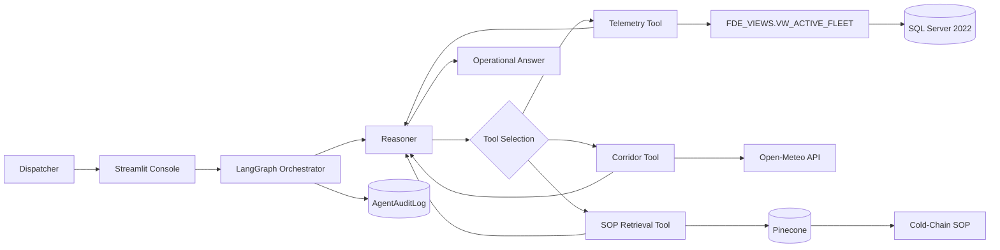

# Cold-Chain Logistics AI Assistant

An end-to-end Forward-Deployed Engineering project that turns fragmented fleet telemetry, live corridor conditions, and operating procedures into one governed dispatcher workflow.

[Try the live application](https://tinyurl.com/2db682kf) · [Read the full project showcase](PROJECT_SHOWCASE.md) · [Open the deployment workflow](https://github.com/Tirth-1999/Cold-Chain-FDE/actions/workflows/deploy.yml)

> The public link redirects to an EC2-hosted Streamlit service. Confirm the instance and `streamlit` systemd service are healthy before a live demonstration.

## Why this is an FDE project

Forward-Deployed Engineers work between customer operations and production engineering. The job is not only to build a model; it is to understand an operational bottleneck, integrate with imperfect systems, ship a usable workflow, and harden it for real users.

This repository demonstrates that full loop:

| FDE responsibility | Implementation in this project |
| --- | --- |
| Discover the operational problem | Model the night-shift dispatch workflow and its telemetry, weather, and SOP handoffs |
| Integrate customer systems | Connect legacy SQL Server data, Pinecone knowledge retrieval, and Open-Meteo conditions |
| Translate messy data | Expose legacy columns through the governed `FDE_VIEWS.VW_ACTIVE_FLEET` semantic view |
| Build the user workflow | Deliver a Streamlit console with chat, visible tool traces, suggested questions, and session threads |
| Add governance | Enforce least-privilege SQL access, narrow tool scope, prompt guardrails, and SQL-backed audit records |
| Deploy into the environment | Run the app and database on separate AWS EC2 nodes with private networking and systemd supervision |
| Make delivery repeatable | Use a manual GitHub Actions workflow with secret checks, SSH reachability checks, and post-deploy health verification |
| Communicate tradeoffs | Document current limitations, security boundaries, and the path from demo to production |

## Customer problem

A cold-chain dispatcher responding to a temperature excursion may need to:

1. Locate the relevant fleet record.
2. Interpret legacy telemetry fields.
3. Check external conditions around the vehicle.
4. Search an SOP for thresholds and escalation rules.
5. Turn those findings into an immediate action plan.

That workflow is slow and inconsistent when it spans separate dashboards, SQL tools, weather sites, and policy documents. The assistant compresses it into a single conversation while preserving evidence, tool visibility, and access controls.

## What the operator can do

- Query active-fleet temperature, coordinates, cargo condition, risk, delay probability, congestion level, and route risk.
- Check current external temperature and wind conditions for a GPS location.
- Retrieve cold-chain thresholds, mitigation procedures, diversion rules, and escalation triggers from the SOP knowledge base.
- Run a full incident investigation that combines telemetry, corridor context, and SOP guidance.
- Inspect the agent's generated tool inputs and raw tool outputs.
- Review SQL-backed execution records through an administrator-gated audit view.
- Open **Questions to Try** for copy-ready prompts organized by workflow.

## Example investigation

Ask:

> Find active fleet records near Los Angeles, check the current weather there, and determine whether the temperature violates the fresh-perishables SOP. What should the dispatcher do?

For a live incident, the system prompt requires the final response to contain:

1. An executive summary and immediate risk.
2. A telemetry and environment analysis table.
3. An SOP-grounded action plan with a compliance citation.

For a procedure-only question, such as “What triggers Tier 2 escalation?”, the agent should use SOP retrieval without running unnecessary fleet or weather tools.

## Architecture



### Agent execution loop

The LangGraph state machine follows `START → reasoner → tools → reasoner`. The reasoner can call only the tools required for the request:

| Tool | Operational purpose | Backing system |
| --- | --- | --- |
| `query_telemetry_db` | Inspect active fleet telemetry | Governed SQL Server view |
| `fetch_corridor_conditions` | Retrieve current temperature and wind by coordinates | Open-Meteo |
| `search_compliance_sop` | Retrieve thresholds and response procedures | Pinecone vector index |

`MemorySaver` keeps conversation context for the active application process and Streamlit session. Tool requests, tool results, and final responses are written to the audit table.

## Governance and security

The primary boundary is enforced below the LLM at the database layer.

| Control | Purpose |
| --- | --- |
| `FDE_VIEWS.VW_ACTIVE_FLEET` | Exposes approved fields with business-readable names |
| `USR_FDE_RO` | Provides the agent with a dedicated least-privilege identity |
| Raw-table denial | Prevents the agent from reading `dbo.TBL_SC_FLEET_HIST_RAW` directly |
| Schema mutation denial | Blocks agent writes and schema changes in `dbo` |
| Tool check | Accepts only SQL beginning with `SELECT` and returns no more than 10 rows |
| `AgentAuditLog` | Allows append-only execution logging from the agent path |
| Prompt scope | Refuses unrelated requests and routes operational questions to the appropriate evidence source |
| Network rules | Restrict SQL port 1433 to the application tier rather than exposing it publicly |

Verify the data boundary as the agent user:

```sql
-- Expected to succeed
SELECT TOP 5 *
FROM FDE_VIEWS.VW_ACTIVE_FLEET;

-- Expected to fail
SELECT TOP 5 *
FROM dbo.TBL_SC_FLEET_HIST_RAW;
```

## RAG ingestion

The policy pipeline supports Markdown, text, PDF, CSV, and Excel documents. It:

1. Parses each format into LangChain documents.
2. Applies format-aware and recursive chunking.
3. Adds source-file, format, and document-type metadata.
4. Uses deterministic chunk IDs.
5. Batches Pinecone upserts.
6. Skips unchanged assets through a content-hash cache.
7. Deletes stale vectors when source files are removed.

Two isolated embedding configurations are available:

| Mode | Embeddings | Index | Dimensions |
| --- | --- | --- | --- |
| Cloud | OpenAI | `fde-sop-index-openai` | 1536 |
| Local | `BAAI/bge-m3` | `fde-sop-index-local` | 1024 |

## Deployment topology

The documented AWS layout separates the application and data tiers:

- **Application EC2:** Streamlit, LangGraph, Python dependencies, and ODBC Driver 18.
- **Database EC2:** SQL Server 2022 running in Docker with persistent storage.
- **Private connection:** application-to-database traffic over VPC networking and security-group rules.
- **Public ingress:** Streamlit on port 8501 and restricted SSH for deployment.
- **Service management:** systemd keeps Streamlit supervised and restartable.
- **Delivery:** a manually triggered GitHub Actions workflow pulls `main`, restarts the service, and verifies it is active.

## Quick start

### Prerequisites

- Python 3.12+
- Docker or an accessible SQL Server 2022 instance
- [Microsoft ODBC Driver 18 for SQL Server](https://learn.microsoft.com/en-us/sql/connect/odbc/download-odbc-driver-for-sql-server)
- Pinecone API key
- OpenAI, DeepSeek, or local Ollama for the reasoning model

### Environment

Create a local `.env` file. Do not commit it.

```dotenv
SQL_SERVER_HOST_CLOUD=
SQL_SERVER_PORT=1433
SQL_ADMIN_USER=
SQL_ADMIN_PASSWORD=
SQL_VIEW_AI_AGENT_USER=USR_FDE_RO
SQL_VIEW_AI_AGENT_PASSWORD=

PINECONE_API_KEY=
EMBEDDING_MODE=LOCAL
Local_Embedding_Model=BAAI/bge-m3

Agent_llm=OLLAMA
OPENAI_API_KEY=
DEEPSEEK_API_KEY=
```

Only populate the model credentials required by your selected reasoning and embedding modes.

### Install and run

```bash
python3 -m venv .venv
source .venv/bin/activate
pip install -r requirements.txt

python scripts/Ingesting_legacy_data.py
python scripts/ingesting_pinecode_data.py

# Run scripts/Setup_security_and_view.sql against SQL Server before the UI.
streamlit run src/ui.py
```

Optional tool and orchestration smoke checks:

```bash
python src/agent_tools.py
python src/orchestrator.py
```

The full infrastructure and deployment runbook is in [`docs/Instruction.md`](docs/Instruction.md).

## Project structure

```text
.github/workflows/deploy.yml       Manual EC2 deployment and health checks
data/cache/                        Incremental-ingestion hash state
data/policy/                       SOP knowledge source
data/raw/                          Legacy logistics dataset
docs/Instruction.md               Setup and deployment runbook
scripts/Ingesting_legacy_data.py   CSV-to-SQL ingestion
scripts/ingesting_pinecode_data.py Policy parsing and Pinecone synchronization
scripts/Setup_security_and_view.sql Semantic view and RBAC setup
src/agent_tools.py                 Telemetry, corridor, and SOP tools
src/orchestrator.py                LangGraph state machine and model routing
src/prompts/system_prompt.txt      Scope, routing, refusal, and output rules
src/trail.sql                      Audit-table DDL and INSERT permission
src/ui.py                          Dispatch, guided questions, and audit UI
PROJECT_SHOWCASE.md                Portfolio narrative and complete demo script
```

## What is intentionally not hidden

A credible FDE delivery makes its boundaries explicit:

- The source dataset is historical/synthetic rather than a production IoT stream.
- The corridor tool uses live weather data, but its displayed congestion index is a wind-based heuristic rather than a road-traffic feed.
- Conversation memory is process-local and does not survive an application restart.
- The repository documents AWS topology but does not yet provision it through Terraform or CloudFormation.
- The application records model and tool activity but does not implement a human approval checkpoint.
- The public demo currently uses an EC2 IP over HTTP; a production-facing deployment should use a domain, TLS, stable addressing, and authentication.

## FDE outcomes demonstrated

- Translate an ambiguous operational need into a concrete user workflow.
- Integrate legacy, SaaS, and public API systems behind a single interface.
- Combine probabilistic reasoning with deterministic access controls.
- Expose evidence and execution traces so operators can verify the agent.
- Ship and operate the solution in the customer's cloud environment.
- Communicate limitations without weakening the business value of the delivered slice.

For the complete demo script, question catalog, design links, and LinkedIn-ready summary, see [PROJECT_SHOWCASE.md](PROJECT_SHOWCASE.md).
